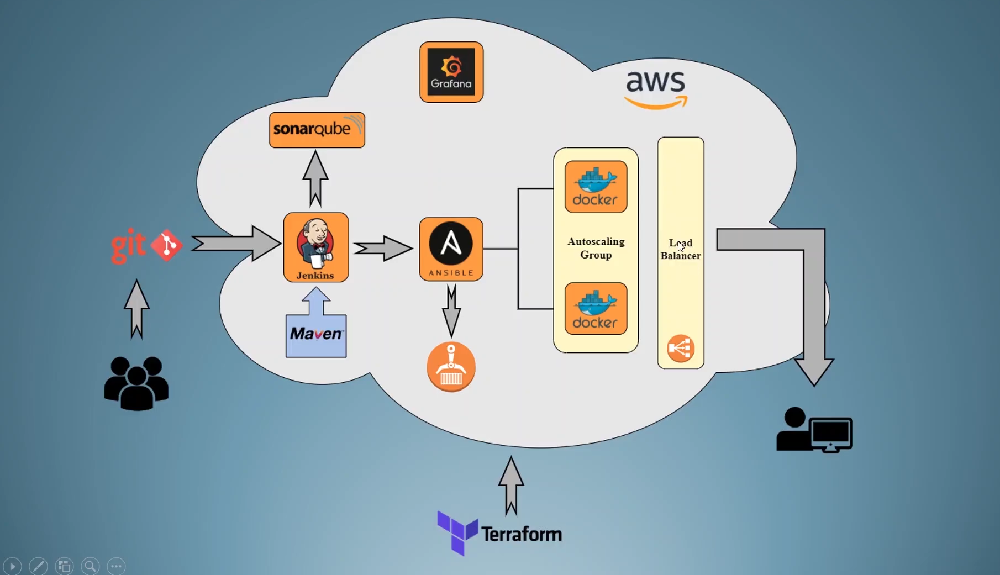

# 🚀 DevOps Infrastructure on AWS with Terraform

## Table of Contents
- [Introduction](#introduction)
- [Architecture Overview](#architecture-overview)
- [Component Breakdown](#component-breakdown)
- [Setup & Deployment Guide](#setup--deployment-guide)
- [Service Usage](#service-usage)
- [Security Considerations](#security-considerations)
- [Troubleshooting](#troubleshooting)
- [Clean Up](#clean-up)
- [Acknowledgements & Further Reading](#acknowledgements--further-reading)

---

## Introduction

This project delivers a **production-grade DevOps infrastructure** on AWS, fully automated with Terraform. It is designed for teams and organizations seeking to:
- Accelerate software delivery with CI/CD pipelines
- Ensure code quality and security
- Achieve scalable, highly available application deployments
- Gain real-time monitoring and operational insights

**Key Technologies:** Terraform, AWS, Jenkins, SonarQube, Ansible, Docker, Grafana

---

## Architecture Overview



**Description:**
- **Source Code** is managed in Git. Developers push code, triggering Jenkins pipelines.
- **Jenkins** orchestrates builds (with Maven), runs tests, and pushes code to SonarQube for quality checks.
- **SonarQube** analyzes code for bugs, vulnerabilities, and code smells.
- **Ansible** is used by Jenkins for configuration management and application deployment.
- **Docker** containers are built and stored in AWS ECR, then deployed to an Auto Scaling Group (ASG) of EC2 instances.
- **Application Load Balancer (ALB)** distributes traffic across the ASG for high availability.
- **Grafana** provides monitoring and visualization.
- **All infrastructure** is provisioned, managed, and versioned using Terraform.

---

## Component Breakdown

### AWS Infrastructure
- **VPC & Subnets:** Isolated network with public/private subnets for security and scalability.
- **Internet Gateway & NAT Gateway:** Enable secure internet access for public and private resources.
- **Security Groups & NACLs:** Fine-grained access control for each service.
- **EC2 Instances:** Dedicated servers for Jenkins, SonarQube, Ansible, and Grafana.
- **Auto Scaling Group (ASG):** Dynamically scales application containers based on demand.
- **Application Load Balancer (ALB):** Ensures high availability and fault tolerance.
- **ECR Repository:** Stores Docker images for application deployment.
- **Key Pair:** Secure SSH access to instances.

### DevOps Toolchain
- **Jenkins:** Automates build, test, and deployment pipelines.
- **SonarQube:** Provides static code analysis and quality gates.
- **Ansible:** Manages configuration and orchestrates deployments.
- **Docker:** Containerizes applications for consistent, portable deployments.
- **Grafana:** Visualizes metrics and monitors system health.

### Automation Scripts
- `jenkins_install.sh`: Installs and configures Jenkins with Java 11.
- `ansible_install.sh`: Installs Ansible, Docker, and Git for automation.
- `grafana_install.sh`: Deploys Grafana in a Docker container with persistent storage.

---

## Setup & Deployment Guide

### Prerequisites
- [Terraform](https://www.terraform.io/downloads.html) v1.0+
- AWS CLI configured with appropriate IAM permissions
- SSH key pair for EC2 access

### Example Variable Values (`terraform.tfvars`)
```hcl
region               = "us-east-1"
vpc_cidr             = "10.0.0.0/16"
all_cidr             = "0.0.0.0/0"
public_subnet1_cidr  = "10.0.1.0/24"
public_subnet2_cidr  = "10.0.2.0/24"
private_subnet_cidr  = "10.0.3.0/24"
availability_zone    = "us-east-1a"
jenkins_port         = 8080
sonarqube_port       = 9090
grafana_port         = 3000
http_port            = 80
ssh_port             = 22
key_name             = "your-key-name"
key_value            = "YOUR_SSH_PUBLIC_KEY_HERE"
linux2_ami           = "ami-0abcdef1234567890"
micro_instance       = "t2.micro"
ubuntu_ami           = "ami-0abcdef1234567890"
small_instance       = "t2.small"
```

### Deployment Steps
1. **Clone the repository**
   ```sh
   git clone <repo-url>
   cd Terraform
   ```
2. **Initialize Terraform**
   ```sh
   terraform init
   ```
3. **Configure variables**
   - Edit `terraform.tfvars` with your values
4. **Plan the deployment**
   ```sh
   terraform plan
   ```
5. **Apply the configuration**
   ```sh
   terraform apply
   ```
6. **Retrieve Outputs**
   - Terraform will display public IPs for Jenkins, SonarQube, Ansible, and Grafana

---

## Service Usage

### Jenkins
- **URL:** `http://<jenkins_public_ip>:8080`
- **Initial Admin Password:** `/var/lib/jenkins/secrets/initialAdminPassword` (SSH into instance to retrieve)
- **Typical Use:**
  - Connect to Git repository
  - Configure Maven build
  - Integrate with SonarQube for code analysis
  - Trigger Ansible playbooks for deployment

### SonarQube
- **URL:** `http://<sonarqube_public_ip>:9090`
- **Default Credentials:** admin/admin
- **Typical Use:**
  - Analyze code quality from Jenkins jobs
  - Set up quality gates and dashboards

### Grafana
- **URL:** `http://<grafana_public_ip>:3000`
- **Default Credentials:** admin/admin
- **Typical Use:**
  - Connect to AWS CloudWatch or other data sources
  - Create dashboards for infrastructure and application monitoring

### Ansible
- **Access:** SSH into Ansible instance using your key
- **Typical Use:**
  - Run playbooks to configure or update application servers
  - Integrate with Jenkins for automated deployments

### Application
- **URL:** Provided by the Load Balancer DNS or public IP (output after apply)
- **Scalability:** Auto Scaling Group ensures high availability and performance

---

## Security Considerations
- **Principle of Least Privilege:** Use IAM roles and security groups with minimal required permissions
- **SSH Key Management:** Protect your private keys; rotate regularly
- **Network Segmentation:** Public and private subnets restrict access
- **Secrets Management:** Do not hardcode secrets; use AWS Secrets Manager or SSM Parameter Store for production
- **Monitoring & Alerts:** Use CloudWatch and Grafana for proactive monitoring

---

## Troubleshooting
- **Terraform Apply Fails:**
  - Check AWS credentials and permissions
  - Ensure all required variables are set
  - Review error messages for resource conflicts or quota issues
- **Instance Not Accessible:**
  - Verify security group rules (SSH, HTTP, etc.)
  - Check subnet and routing configurations
- **Jenkins/SonarQube/Grafana Not Starting:**
  - SSH into the instance and check service logs (`systemctl status <service>`, `docker logs <container>`)
- **Outputs Not Displayed:**
  - Ensure `outputs.tf` is present and correctly references resources

---

## Clean Up
To destroy all resources and avoid ongoing AWS charges:
```sh
terraform destroy
```

---

## Acknowledgements & Further Reading
- [Terraform Documentation](https://www.terraform.io/docs/)
- [AWS Well-Architected Framework](https://aws.amazon.com/architecture/well-architected/)
- [Jenkins Documentation](https://www.jenkins.io/doc/)
- [SonarQube Documentation](https://docs.sonarqube.org/)
- [Ansible Documentation](https://docs.ansible.com/)
- [Grafana Documentation](https://grafana.com/docs/)

---

> **Crafted with ❤️ for DevOps excellence.** 